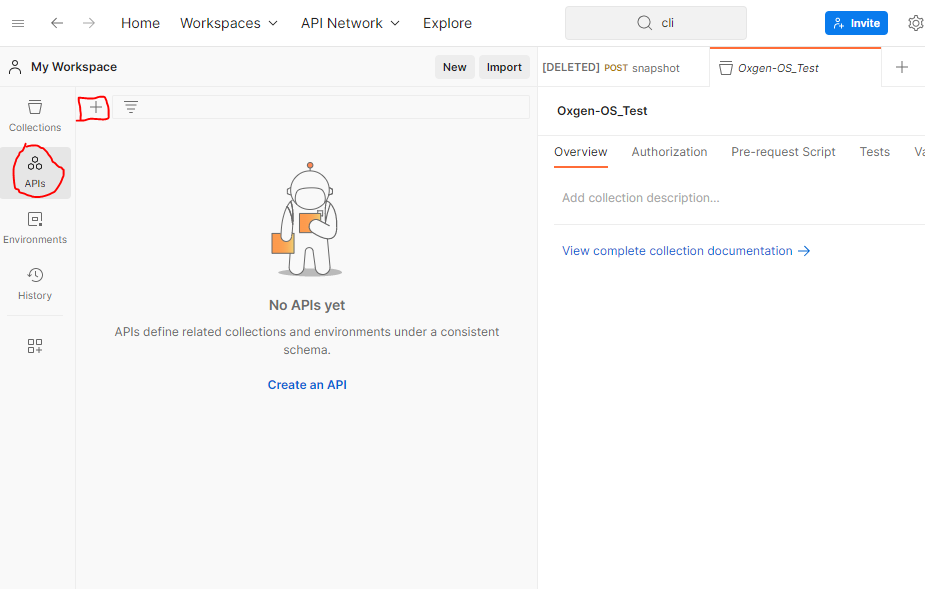
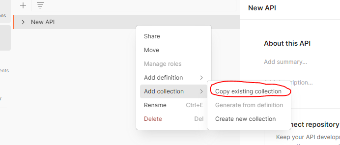

# Test API avec Postman

## Importer la collection Postman contenant des tests
1. drag-and-drop le fichier ###.postman_collection.json dans l'interface de postman. L'application va l'ajouter dans la collection.

2. Clique sur l'icone "..." de la collection importé, puis cliquer sur Run collection.

3. CLiquer sur le bouton "Run ### test".

