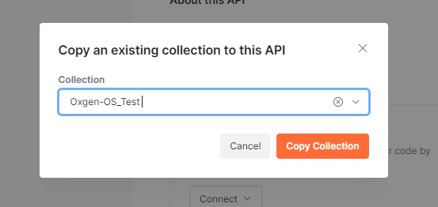

# Test API avec Postman

## Importer la collection Postman contenant des tests
1. drag-and-drop le fichier ###.postman_collection.json dans l'interface de postman. L'application va l'ajouter dans la collection.

2. Cliquer sur l'icone + pour ajouter un API vide dans l'écran API.

3. Apres avoir ajouté un API, faire un clique droit sur l'api vide, cliquer sur "Copy existing collection".

4. Apres avoir choisit une collection existante, appuyer sur le bouton "Copy Collection".

5.